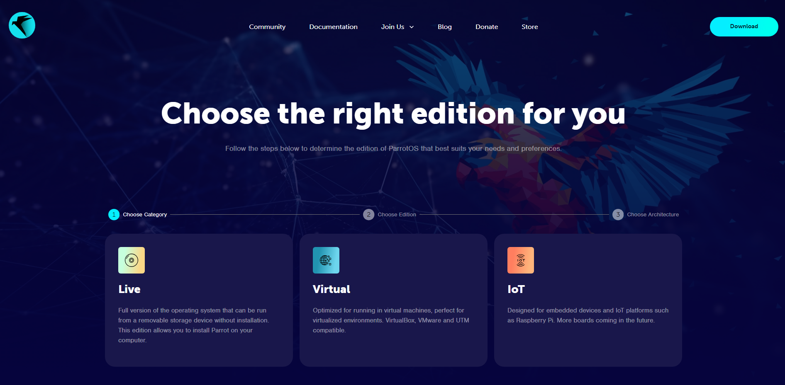
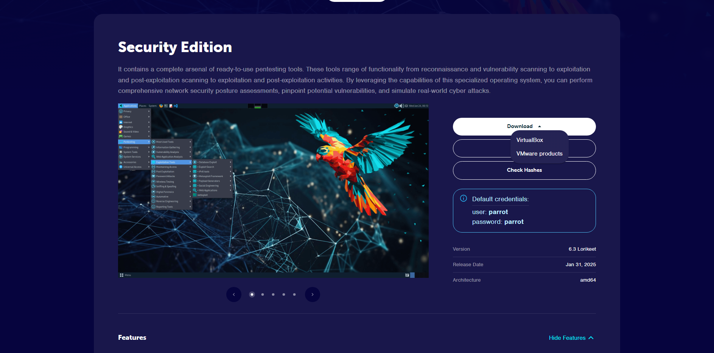
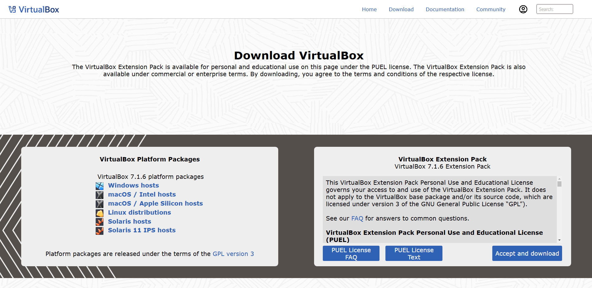
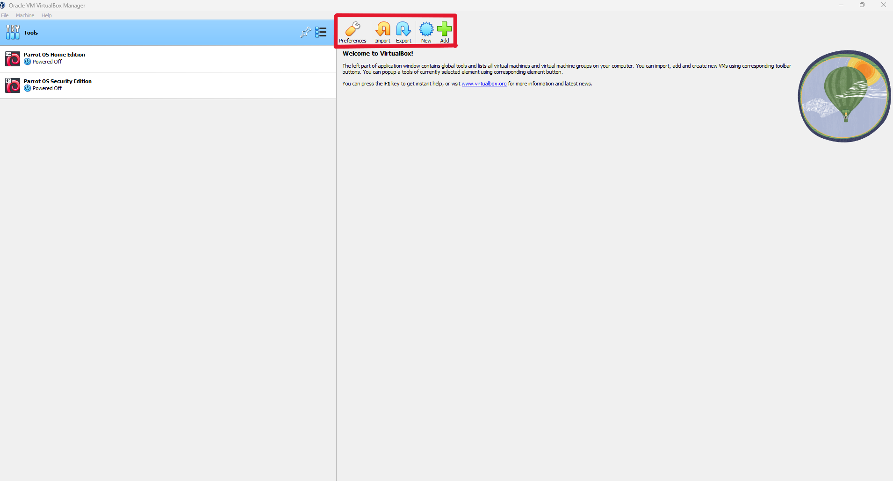
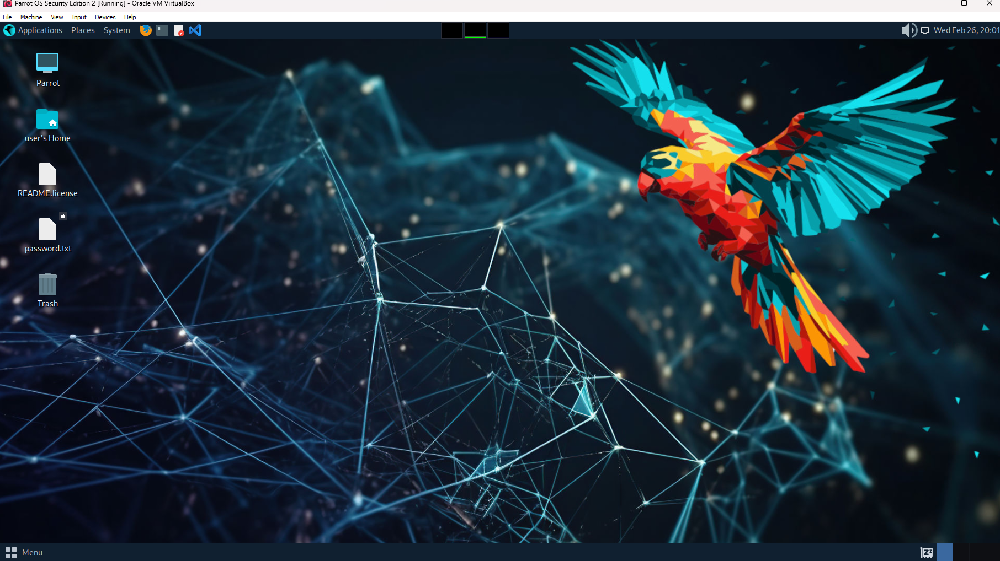

## Setting Up ParrotOS Virtual Machine for HackTheBox

Setting up a local Virtual Machine to practice HackTheBox labs is a simple process to allow users the ability to have all available tools and practice in a more personalized sandbox environment. 

--- 

### ParrotOS

The Parrot Linux distribution is an operating system that is full of pre-installed implements ideal for learning in both the beginner and advanced areas offered by HTB. 

To begin, the ParrotOS OVA can be downloaded from the ParrotSec official site at [parrotsec.org/download/](https://parrotsec.org/download/)

Choose the category "Virtual"

Then the "Security" edition, as it is the version that comes with most of the tools needed for the labs, and then the "AMD64" architecture.

From here, you can directly download or torrent the OVA. For this example, select "Download" and then "VirtualBox" at the dropdown.

---

### VirtualBox VM

To create the VM with the OVA, a hypervisor like VirtualBox must be used. 

Oracle's VirtualBox can be downloaded from the official site at [virtualbox.org/wiki/downloads](virtualbox.org/wiki/Downloads) and the package can be chosen on the left based on your OS.

Upon installing and launching VirtualBox, pressing the "Import" button in the top menu will allow you to import the ParrotOS OVA downloaded earlier through the pop-up window.

After specifying a folder to save the VM to and agreeing to the Service Agreement, VirtualBox will import the OVA and Create the VM. 

!!! note ""
    Note: Once the VM is created, the "Settings" menu in VirtualBox can be used to specify more advanced settings, like how much memory on the system to allocate for the VM.

Pressing the "Start" button in the top menu with the new Parrot OS Security Edition VM selected will open the Virtual Machine in a new window.

Once booted completely, it can be used to go to the HackTheBox site and begin setup of the VPN for labs.

